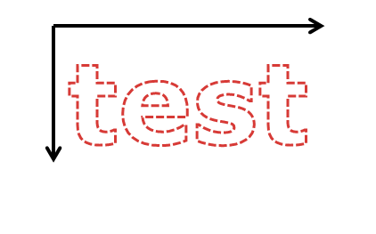
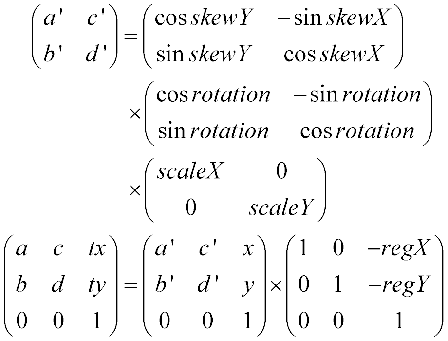
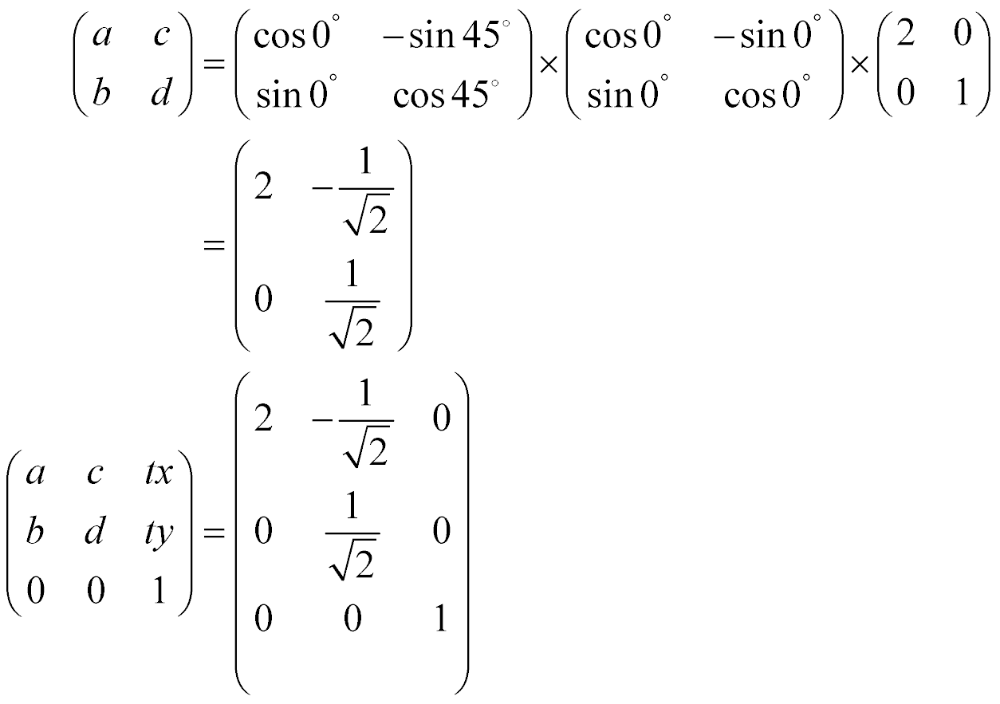
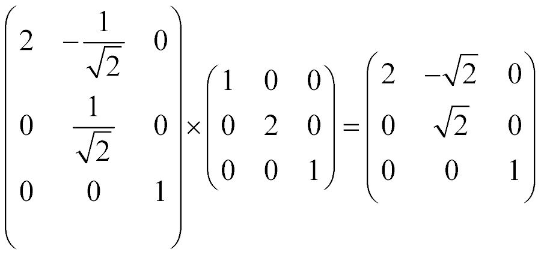
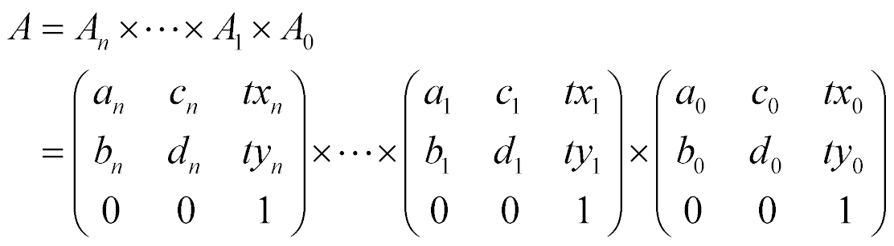
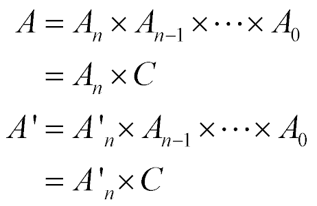

# Inside wahid

This document describes why we create this library and how this library emulates
[CreateJS].

# Background

[CreateJS] is a [JavaScript] library consisting of four modules:

* [EaselJS];
* [SoundJS];
* [TweenJS], and;
* [PreloadJS].

Adobe [Flash Pro] can publish its animation assets as [JavaScript] code that
uses [CreateJS] so [HTML5]-compliant browsers can run them without plug-ins.
Adobe [Flash Pro] were so popular among game developers that they used
[CreateJS] animations generated by Adobe [Flash Pro] in their [HTML5] games.

Unfortunately, their [HTML5] games did not run as smoothly on smartphones as
they expected. To investigate the games, smartphones consumed lots of CPU
resources (e.g. processing power, memory, etc.) to play [CreateJS] animations
and they could not allocate their CPU resources sufficiently to the games
themselves.

After this investigation, we decided to develop a new [JavaScript] library
compatible with [CreateJS] from scratch. Technically, there were several other
options to run their [HTML5] games more smoothly:

* Simplifying [CreateJS] animations;
* Changing [CreateJS] code, and;
* Using alternatives (e.g. Unity, Cocos 2D, etc.).

For each option, we talked about its pros and cons with game developers to find
the best option for them. While this talk, they encouraged for us (i.e.
[HTML5]-game developers) to develop a new platform optimized for [HTML5] games
and we started developing this library as part of our new [HTML5]-game platform.

## Design principals

This library is developed on the following principals to play [CreateJS]
animations as smoothly as native ones on smartphone browsers:

* Optimize for smartphone browsers;
* Use caches;
* Offload tasks;
* Combine all the [CreateJS] modules into one library, and;
* Optimize for module loaders.

### Optimizing for smartphone browsers

Good native games are well-optimized for their platforms, especially when they
run on platforms that do not have much processing power. We also optimize this
library for our primary target, i.e. smartphone browsers.

Smartphones (especially Android 4.x ones) do not have as much CPU power as PCs.
To run [CreateJS]-based games on smartphone browsers as fast as native games, we
optimized this library for modern (smartphone) browsers, which provide lots of
[HTML5] APIs (e.g. [WebGL], [Indexed Database], [XMLHttpRequest v2],
[Object URL], etc.), and implemented only [CreateJS] features that can run on
them as fast as native games. (This causes compatibility problems with
[CreateJS] as written in
[Compatibility with CreateJS](#compatibility-with-createjs).)

Smartphone operating systems (i.e. iOS and Android) have out-of-memory killers
to kill memory-consuming applications when they run out of memory. Games often
use lots of resources (e.g. images and sounds) and they are very likely to be
killed by out-of-memory killers when their host systems run out of memory. To
make this issue worse, [HTML5] games often cache their views, i.e. they switch
their views without discarding their current views. Caching views of [HTML5]
games remarkably increases its memory consumption, i.e. [HTML5] games are more
likely to be killed by out-of-memory killers. To prevent [HTML5] games from
being killed by out-of-memory killers, this library discards its resources
__quite aggressively__, e.g.:

* A [createjs.DisplayObject] object deletes all its properties when it is
  removed from its parent, and;
* A [createjs.Stage] object immediately destroys all its resources (e.g.
  [WebGL] textures, `<canvas>` elements, sounds, etc.) when it receives a
  `hashchange` event.

### Using caches

Good native games effectively use caches to avoid unnecessary network access.
We also implement a cache to avoid loading [CreateJS] resources multiple times.

Games usually use [PreloadJS] to load lots of [CreateJS] resources (e.g. images,
sounds, [JavaScript] files, etc.) from servers. It usually takes long time for
smartphone browsers to load the resources via wireless networks and it is
frustrating for users to wait for smartphone browsers to load them. Loading
resources also interferes communications between a client and a server, i.e. it
causes glitches in retrieving server responses. To accelerate loading resources,
we cache resources (including binary ones) to a local database and re-loads
resources only when games invalidate the cache.

Smartphone browsers have [HTML5] APIs that accept binary data (e.g.
[Indexed Database], [XMLHttpRequest v2], [Object URL], etc.) and the
section [Emulating PreloadJS](#emulating-preloadjs) describe how we implement
the cache with these APIs.

### Offloading tasks

Good native games effectively use GPUs and threads for offloading. We also use
GPUs and `<iframe>` pages to offload [CreateJS] tasks.

We do not only use [WebGL] to offload some rendering tasks from a CPU to a GPU,
but also use an `<iframe>` worker to offload [SoundJS] tasks from a game
page to an `<iframe>` page.

A smartphone game consists of lots of tasks (retrieving resources, communicating
with a server, rendering images, playing sounds, etc.) Executing all these tasks
in the game page often causes glitches and game developers usually have to
executing CPU-consuming tasks in the background by themselves to avoid these
glitches. Unfortunately, it is not so easy for game developers to controlling
background tasks. To help game developers, we automatically offload rendering
tasks to GPUs and offload [SoundJS] tasks to workers, respectively.

### Combining CreateJS modules

Good native games do not have redundant code. We also remove redundancies of
[CreateJS].

[CreateJS] uses plug-ins to extend their capabilities and games use some
plug-ins (especially filters). On the other hand, these plug-ins need
redundancies and increase the module size. We combine all [CreateJS] modules and
plug-ins frequently used by games into one [JavaScript] module so we can apply
inter-module optimizations and remove redundancies.

### Optimizing for module loaders

Good native games do not load unnecessary modules (a.k.a. shared libraries). We
also allow games to load this library when they use it.

A game usually consists of lots of [JavaScript] files (including ones generated
by Adobe [Flash Pro]) and loads them asynchronously with module loaders (e.g.
[RequireJS]). We export only the [CreateJS] symbols used by games to avoid name
conflicts. It also provides a compile flag `createjs.SUPPORT_AMD` to build this
library as an [AMD] module, i.e. we do not export any symbols to the global
namespace when this flag is true.

# Compatibility with CreateJS

This library does __NOT SO MUCH__ focus on compatibility with [CreateJS], i.e.
it sacrifices compatibility not only for improving game speed but also for
reducing memory consumption. Although this library has classes and methods
compatible with [CreateJS], they are implemented with fast [HTML5] APIs.
Unfortunately, these fast [HTML5] APIs are incompatible with the slow [HTML5]
APIs used by [CreateJS] and it is not so easy to make this library 100%
compatible with [CreateJS] with these fast and incompatible [HTML5] APIs.

In practice, this library has __many__ compatibility issues with [CreateJS],
e.g.:

* A tween can change its position only once per frame;
* A [CreateJS] object destroys itself when its parent removes it;
* A large [createjs.Shape] object looks blurry;
* A [CreateJS] object can attach only one mask, etc.

Unfortunately, we decided to leave these compatibility issues open because we
cannot fix these compatibility issues without losing game speed or increasing
memory consumption. We wish game developers are able to work around them to
develop good games. (These issues are due to the lack of our programming ability
and we are working hard to find solutions without losing game speed or
increasing memory consumption.)

This library is __not fail-safe__. This library calculates internal variables
in rendering [CreateJS] objects and uses them in rendering the objects next
time, i.e. when there is an exception in rendering a [CreateJS] object, this
library cannot any longer render the [CreateJS] object as expected. (This issue
happens when there is a [JavaScript] error in a tween action.)

# Architecture

This library roughly consists of four modules and each module emulates one
[CreateJS] one:

* An [object renderer](#emulating-easeljs), which emulates [EaselJS];
* An [animation player](#emulating-tweenjs), which emulates [TweenJS];
* A [sound player](#emulating-soundjs), which emulates [SoundJS], and;
* A [resource loader](#emulating-preloadjs), which emulates [PreloadJS].

Each module depends on other ones, i.e. it is not so easy to extract one module
from this library.

# Emulating EaselJS

Games often use thousands of [CreateJS] objects simultaneously and render them
with [EaselJS]. They also use huge bitmaps (i.e. larger than 1 mega pixels) to
draw crisp images on smartphone screens.

Our object renderer is designed for [WebGL] to run such games as fast as native
games on smartphone browsers that provide [WebGL] (e.g. [Chrome] for [Android],
Mobile [Safari], [Internet Explorer] Mobile, etc.), i.e. it renders all
[CreateJS] objects (e.g. [createjs.Bitmap], [createjs.Text], [createjs.Shape],
[createjs.Sprite], etc.) with [WebGL] on smartphone browsers.

## Implementing a shader program

Our object renderer use a custom shader program optimized for [CreateJS] to
render an image (i.e. an `` element, a `<canvas>` element, or a `<video>`
element) with [WebGL].

```glsl
  // The vertex shader.
  attribute vec2 position;  // The destination position.
  attribute vec2 texture;   // The source position.
  uniform vec2 screen;      // The screen scale.
  uniform mat3 transform;   // The global affine transformation.
  varying vec2 uv_point;
  void main() {
    // Apply the affine transformation to the destination position.
    vec3 v = transform * vec3(position[0], position[1], 1);

    // Convert the position from the HTML coordinate "(0,0)-(width,height)" to
    // the WebGL one "(-1,-1)-(1,1)".
    gl_Position = vec4(v[0] * screen[0] - 1.0, v[1] * screen[1] + 1.0, 0, 1);

    // Pass the source position to the fragment shader.
    uv_point = texture;
  }
```

```glsl
  // The fragment shader.
  precision mediump float;
  varying vec2 uv_point;
  uniform sampler2D image;
  uniform vec4 alpha;       // The alpha transparency
  uniform mat4 matrix;      // The color matrix
  uniform vec4 offset;      // The color offset
  void main() {
    // Retrieve the pixel at the source position.
    vec4 v = texture2D(image, uv_point);

    // Apply the color-matrix filter to the source pixel and multiply the global
    // alpha with its result. (The color offset must be multiplied with the
    // alpha value of the source pixel because WebGL uses premultiplied-alpha
    // pixels.)
    gl_FragColor = alpha * (matrix * v + offset * v[3]);
  }
```

Our object renderer can render one of an `` element, a `<canvas>` element,
or a `<video>` element with this shader program as listed below:

1. Create a [WebGL] texture from an `` element, a `<canvas>` element, or a
   `<video>` element;
2. Set the global [affine transformation] of the element (a 3x3 augmented matrix
   representing its _position_ in the output `<canvas>` element) to the
   `transform` variable;
3. Set a [blend function];
4. Set [createjs.ColorMatrix] values to the `matrix` variable and to the
`  offset` variable;
5. Set an alpha transparency to the `alpha` variable;
6. Set a source rectangle to the `texture` attribute, and;
7. Draw a triangle strip.

On the other hand, our object renderer still cannot render [CreateJS] objects
with [WebGL]. It needs to implement the following features to render a
[CreateJS] object.

* Creating a [WebGL] texture from a [CreateJS] object;
* Calculating the global [affine transformation] of a [CreateJS] object, and;
* Converting a composition mode to a [blend function].

## Creating WebGL textures

For [createjs.Bitmap] objects and [createjs.Sprite] objects, our object renderer
uses their `` elements to create their [WebGL] textures. For
[createjs.Text] objects and [createjs.Shape] objects, it draws them to memory
`<canvas>` elements and uses the `<canvas>` elements to create their [WebGL]
textures. Our object renderer adds a new class `createjs.Video` to integrate
code necessary for rendering `<video>` elements inline.

### Creating WebGL textures from createjs.Bitmap objects

A [createjs.Bitmap] object uses its `` element as its bitmap and uses its
`sourceRect` property as its source rectangle, respectively. Once when a
[createjs.Bitmap] object creates a [WebGL] texture from an `` element,
it attaches the [WebGL] texture to the `texture_` property of the element to
prevent creating multiple [WebGL] textures from an `` element.
Multiple [createjs.Bitmap] objects often share one `` element and it
does not make sense to create multiple [WebGL] textures from an ``
element. (An `` element cannot change its image and [createjs.Bitmap]
object does not have to update the [WebGL] texture attached to it.)

### Creating WebGL textures from createjs.Sprite objects

A [createjs.Sprite] object uses its `` element as its bitmap as a
[createjs.Bitmap] does. On the other hand, it calculates its source rectangle
from its [createjs.SpriteSheet] object at run time, i.e. a [createjs.Sprite]
object changes its source rectangle every other frame.

### Creating WebGL textures from createjs.Text objects

A [createjs.Text] object has a memory `<canvas>` element and uses the
`<canvas>` element as its [WebGL] texture. A [createjs.Text] creates its
[WebGL] texture as listed below:

1. Calculate the width of its memory `<canvas>` element and its height;

   

2. Render its text to the element, and;

   

3. Create a [WebGL] texture from the element.

   

Currently, a [createjs.Text] object does not use the `zoom` property in 
calculating the width of its memory `<canvas>` element or its height, i.e.
[createjs.Text] objects become blurry when a web page has a 'zoom' property.

Once when a [createjs.Text] object creates a [WebGL] texture from its memory
`<canvas>` element, it attaches the [WebGL] texture to the element to update
the [WebGL] texture when the object has its text changed.
The text of a [createjs.Text] object is often changed either by a game or by a
tween as listed in the following code snippet.

```javascript
  // Create an empty createjs.Text instance. (This does not create either a
  // memory <canvas> element or a WebGL texture.)
  var text = new createjs.Text('', '20px Arial', '#fff');

  // Changing the text property automatically updates its <canvas> element and
  // its WebGL texture.
  text.text = 'DEF';
```

When a [createjs.Text] object has its text changed, it has to redraw the changed
text to its memory `<canvas>` element to update its [WebGL] texture. It is not
so fast to update the [WebGL] texture of a [createjs.Text] object and we attach
a setter method to the 'text' property to update the [WebGL] texture only when
it is changed either by a game or by a tween.

```javascript
  Object.defineProperties(createjs.Text.prototype, {
    'text': {
      get: createjs.Text.prototype.getText,
      set: createjs.Text.prototype.setText
    },
    'font': {
      get: createjs.Text.prototype.getFont,
      set: createjs.Text.prototype.setFont
    },
    ...
  });
```

It is not so often for multiple [createjs.Text] objects to share one text and
[createjs.Text] objects do not share memory `<canvas>` elements. To reduce
memory consumption, a createjs.Text object explicitly deletes both its memory
`<canvas>` element and its [WebGL] texture when it is detached from a
[CreateJS] object tree.

### Creating WebGL textures from createjs.Shape objects

Our object renderer does not only use memory `<canvas>` elements to render
[createjs.Shape] objects but also it uses a shared cache so multiple
[createjs.Shape] objects can automatically share [createjs.Graphics] objects.

Adobe [Flash Pro] generates [JavaScript] code that creates a [createjs.Shape]
instance in its constructor (not its prototype) as listed in the following code
snippet.

```javascript
  (lib.my_shape = function() {
    this.initialize();

    // Layer 1
    this.shape = new cjs.Shape();
    this.shape.graphics.f("#ffffff").p("...");

    this.addChild(this.shape);
  }).prototype = p = new cjs.Container();
```

This code shows creating one `lib.my_shape` instance creates one
[createjs.Shape] instance (and one [createjs.Graphics] instance). When another
Flash-generated class `lib.movie` creates three `lib.my_shape` instances in its
constructor as listed in the following code snippet, creating one `lib.movie`
instance creates three `lib.my_shape` instances, i.e. it creates three
[createjs.Shape] instances of the same image.

```javascript
  (lib.movie = function () {
    this.instance_0 = new lib.my_shape();
    this.instance_1 = new lib.my_shape();
    this.instance_2 = new lib.my_shape();
  }).prototype = p = new cjs.Container();
```

(This case often happens when games use [createjs.Shape] objects as particles.)
Our object renderer uses a shared cache so such [createjs.Shape] instances of 
he same image can automatically share one [createjs.Graphics] instance.

The [createjs.Shape] class automatically compresses huge shapes to save memory
consumed by its  memory `<canvas>` element and by its [WebGL] texture, e.g. the
[createjs.Shape] object in the following snippet draws a star to a 2048x2048
`<canvas>` element and its memory `<canvas>` element consumes about 16 MB of
memory.

```javascript
  var shape = new createjs.Shape();
  shape.graphics.f('#58c').drawPolyStart(1024, 1024, 1024, 5, 0.5, -90);
```


The [createjs.Shape] class automatically decreases the shape width to 64 and its
height to 64, respectively. It also increases its scales so its visible width is
equal to the original one and so is its visible height, i.e. it automatically
replaces the above shape with the one listed below.

```javascript
  var shape = new createjs.Shape();
  shape.graphics.f("#58c").drawRect(64, 64, 64, 5, 0.5. -90);
  shape.scaleX = 16;
  shape.scaleY = 16;
```


This compression is a lossy compression algorithm and compressed
[createjs.Shape] objects look blurry.

### Creating WebGL textures from createjs.Video objects

Our object renderer has a new class `createjs.Video` that encapsulates a
`<video>` element to play it inline.

It is not so trivial to render a `<video>` element:

* A [WebGL] texture needs to update its image according to the position of a
  `<video>` element.
* [Internet Explorer] cannot create a [WebGL] texture from a `<video>` element;
* Mobile [Safari] needs
  [tweaks](http://webkit.org/blog/6784/new-video-policies-for-ios/) to play a
  `<video>` element inline, etc.

The `createjs.Video` class implements these browser-specific issues so our
object renderer can create [WebGL] textures from `<video>` elements and update
them. This class also has methods to safely start playing `<video>` elements and
to stop playing them.

## Calculating global affine transformations

A [CreateJS] object has an [affine transformation], a 3x3 augmented matrix
representing the relative _position_ from its parent. It is calculated from the
[createjs.DisplayObject] properties (`x`, `y`, `scaleX`, `scaleY`, `skewX`,
`skewY`, `rotation`, `regX`, and `regY`) as listed below:



For example, for a [createjs.Bitmap] object with its `scaleX` 2 and its `skewX`
45 degrees, its [affine transformation] is calculated as listed below:



The global [affine transformation] of a [CreateJS] object is an
[affine transformation] representing its global _position_, i.e. the _position_
in the output `<canvas>` element. For all visible [CreateJS] objects, we need
their global [affine transformations] to render them with [WebGL].

The global [affine transformation] of a [CreateJS] object is equal to the
product of all [affine transformations] of the [CreateJS] object and its
ancestors, e.g. when the above [createjs.Bitmap] object is a child of a
[createjs.Stage] object with its `scaleY` 2, its global [affine transformation]
is calculated with multiplying the [affine transformation] of the
[createjs.Stage] object by the one of the [createjs.Bitmap] object as listed below:



In general, it is slow to calculate the global [affine transformations] of all
visible [CreateJS] objects. Assume a tree of [CreateJS] objects and their
[affine transformations] (`A[0]`, ..., `A[n]`) as listed below.

```
  stage                 A[0]
   |
   +- container         A[1]
        |
       ...
        +- container    A[n-1]
             |
             +- bitmap0 A[n]
```

To denote the global [affine transformation] of the `bitmap0` as `A`, (n-1)
matrix multiplications are needed to calculate `A` as listed below:



This equation shows each [CreateJS] object needs (n-1) matrix multiplications to
calculate its global [affine transformation], i.e. it needs the following number
of matrix multiplications to calculate the global [affine transformations] of
all [CreateJS] objects:

  (the depth of each [CreateJS] object) * (the number of [CreateJS] objects)

Games commonly use hundreds of visible [CreateJS] objects and it is very slow
for smartphone browsers to calculate their global [affine transformations].

### Caching global affine transformations

To improve the calculation speed of global [affine transformations], we cache
the global [affine transformations] of [CreateJS] objects. Assume a
tree of [CreateJS] objects containing two bitmaps (`bitmap0` and `bitmap1`).

```
  stage                 A[0]
   |
   +- container         A[1]
        |
       ...
        +- container    A[n-1]
             |
             +- bitmap0 A[n]
             |
             +- bitmap1 A'[n]
```

To denote the global [affine transformation] of `bitmap0` as `A`, the one of
`bitmap1` as `A'`, and the one of `container` as `C`, they satisfy the following
equations.



These equations show `A` and `A'` share the matrix `C`, i.e. when `container`
caches its global [affine transformation] `C`, `A` is calculated with one matrix
multiplication and `A'` is calculated with one matrix multiplication,
respectively. To use mathematical induction, it needs the following number of
matrix multiplications to calculate the global [affine transformations] of all
[CreateJS] objects when each [CreateJS] object caches its global
[affine transformation]:

  (the number of [CreateJS] objects)

### Monitoring the properties of CreateJS objects

To avoid unnecessary matrix multiplications, we monitor the properties of
each [CreateJS] object and calculate its global [affine transformation] only
when it has its properties changed by games or tweens.

A public property of a [CreateJS] object has a setter method as listed in the
following code snippet. The setter functions of a [CreateJS] object set true to
its dirty flag to re-calculate its global [affine transformation] next time
when it rendered. (Tweens uses the `createjs.TweenTarget` interface to change
properties.)

```javascript
Object.defineProperties(createjs.DisplayObject.prototype, {
  'x': {
    get: createjs.DisplayObject.prototype.getX,
    set: createjs.DisplayObject.prototype.setX
  },
  'y': {
    get: createjs.DisplayObject.prototype.getY,
    set: createjs.DisplayObject.prototype.setY
  },
  ...
});
```

## Converting a composition mode to a blend function

Our object renderer emulates a composition modes of [Canvas 2D] with a
[blend function] of [WebGL].

Our object renderer replaces a composition mode of [Canvas 2D] with a
[blend function] of [WebGL] as listed in the following table. (These conversions
assume [WebGL] textures are premultiplied-alpha ones, i.e. our object renderer
has to set 1 to the gl.[UNPACK_PREMULTIPLY_ALPHA_WEBGL] flag.)

<table>
  <tr><th rowspan="2">composition mode</th><th colspan="2">blend mode</th></tr>
  <tr><th>source</th><th>destination</th></tr>
  <tr><td>source-over</td><td>ONE</td><td>ONE_MINUS_SRC_ALPHA</td></tr>
  <tr><td>source-atop</td><td>DST_ALPHA</td><td>ONE</td></tr>
  <tr><td>source-in</td><td>DST_ALPHA</td><td>ZERO</td></tr>
  <tr><td>source-out</td><td>ONE_MINUS_DST_ALPHA</td><td>ZERO</td></tr>
  <tr><td>destination-over</td><td>ONE_MINUS_DST_ALPHA</td><td>ONE</td></tr>
  <tr><td>destination-atop</td><td>ONE</td><td>SRC_ALPHA</td></tr>
  <tr><td>destination-in</td><td>ZERO</td><td>SRC_ALPHA</td></tr>
  <tr><td>destination-out</td><td>ZERO</td><td>ONE_MINUS_SRC_ALPHA</td></tr>
  <tr><td>lighter</td><td>ONE</td><td>ONE</td></tr>
  <tr><td>copy</td><td>ONE</td><td>ZERO</td></tr>
  <tr><td>xor</td><td>ONE_MINUS_DST_ALPHA</td><td>ONE_MINUS_SRC_ALPHA</td></tr>
  <tr><td>darker</td><td>DST_COLOR</td><td>ONE</td></tr>
  <tr><td>multiply</td><td>ZERO</td><td>SRC_COLOR</td></tr>
</table>

This conversion is not perfect because our shader program cannot blend pixels
outside of the source rectangle. This incompatibility causes rendering issues
when the composition mode is not one of `source-over`, `source-atop`,
`destination-over`, `lighter`, `darker`, or `multiply`.

## Implementing a mask

Our object renderer partially implements the `DisplayObject.prototope.mark`
property so it can render masked [CreateJS] objects.

[WebGL] has the [scissor test] to clip a bitmap with a rectangle. On the other
hand, it does not have trivial methods to mask a bitmap with another. (This does
not mean it is impossible to mask a bitmap with another, though.)

Our object renderer draws a [CreateJS] object and its mask to an off-screen
framebuffer to draw a masked [CreateJS] object:

1. Draw a mask into a memory `<canvas>` element (only once);

   

2. Switch a rendering target to an off-screen framebuffer;
3. Enables the scissor test to the off-screen framebuffer to render only the
   inside of the mask;
4. Draw the [CreateJS] object onto the off-screen framebuffer;

   

5. Draw the memory `<canvas>` element to the off-screen framebuffer with its
   composition mode `destination-in`, and;

   

6. Draw the off-screen framebuffer to the output framebuffer.

This implementation currently has limitations:

* A mask must be a [createjs.Shape] object;
* A mask can be applied only to [createjs.Bitmap] object, and;
* A [CreateJS] object can apply only one mask.

## Choosing the best rendering API

Our object renderer uses an API-independent interface (denoted as the
`createjs.Renderer` interface) to render [CreateJS] objects. This library
implements the `createjs.Renderer` interface both with [WebGL] and with
[Canvas 2D] so we can choose the best rendering API for browsers.

Our object renderer uses [WebGL] to render [CreateJS] objects on the following
browsers:

* Apple Mobile [Safari] \(iOS 8 or later\);
* Apple [Safari] \(macOS\);
* Google [Android] stock browsers ([Android] 5.0 or later).
* Google [Chrome];
* Microsoft [Internet Explorer] 11;
* Microsoft [Edge], and;
* Mozilla [Firefox].

On the other hand, it use [Canvas 2D] on the following browsers:

* Apple Mobile [Safari] \(iOS 7 or earlier\);
* Google [Android] stock browsers ([Android] 4.4 or earlier), and;
* Microsoft [Internet Explorer] 10.

Currently, there are not any methods for games to choose the API used by our
object renderer.

### The createjs.Renderer interface

This `createjs.Renderer` interface is a common subset of [Canvas 2D] and
[WebGL]. This interface provides the following methods and properties of the
[CanvasRenderingContext2D] interface:

* The [drawImage]\(\) method;
* The [setTransform]\(\) method;
* The [globalComposteOperation] attribute, and;
* The [globalAlpha] attribute.

Our object renderer provide a couple of classes that implements the
`createjs.Renderer` interface:

* The `createjs.WebGLRenderer` class, which implements the interface with
  [WebGL], and;
* The `createjs.CanvasRenderer` class, which implements the interface with
  [Canvas 2D].

Our object renderer uses the `createjs.WebGLRenderer` class to render [CreateJS]
objects on browsers that provide [WebGL] (including Android browsers that
provide experimental [WebGL] implementation, which is not compliant with the
[WebGL] specification), and it uses the `createjs.CanvasRenderer` class on
browsers that do not.

## Dispatching events

Games attach event listeners to [CreateJS] objects and they expect an event is
dispatched to their listeners without delay or glitches, even when a tree
consists of thousands of [CreateJS] objects. Some games also expect an event is
dispatched to their listeners only when its position points to non-transparent
pixels, i.e. we have to read pixels of [CreateJS] objects to dispatch an event.

We use rendering results not only to prevent traversing [CreateJS] objects that
do not have event listeners attached but also to prevent traversing [CreateJS]
objects that do not intersect with an event position.

### Collecting events

For each [CreateJS] object, our object renderer recursively collects events
listened by the object or its descendants to traverse only [CreateJS] objects
that have event listeners. Games often uses huge [CreateJS]-object trees,
consisting of thousands of [CreateJS] objects, and it is very slow to traverse
all of them to dispatch an event.
When our object renderer renders a [CreateJS] object, it returns a set of events
listened by the object or its descendants.

For example, assume the following tree of [CreateJS] objects.

```
  stage
   |
   +- container0
   |   |
   |   +- bitmap0
   |   |
   |   +- bitmap1
   |
   +- container1
       |
       +- shape0
```

When `bitmap1` has a `click`-event listener `listener0`, we need to traverse
three [CreateJS] objects `stage`, `container0`, and `bitmap1` to dispatch a
`click` event to `listener0`.

```
  stage *
   |
   +- container0 *
   |   |
   |   +- bitmap0
   |   |
   |   +- bitmap1 * {click: listener0}
   |
   +- container1
       |
       +- shape0
```

When our object renderer renders this tree, `bitmap0` returns an event `click`
to `container0`, and `container0` returns the event `click` to `stage`,
respectively.

```
  stage click
   |
   +- container0 click
   |   |
   |   +- bitmap0
   |   |
   |   +- bitmap1 {click: listener0}
   |
   +- container1
       |
       +- shape0
```

When `stage` dispatches a `click` event, each [CreateJS] object looks up its
event set to prevent `stage` from traversing `container1` and to prevent
`container0` from traversing `bitmap0`, respectively.

```
  stage click
   |
   +- container0 click
   |   |
   |   +- bitmap0
   |   |
   |   +- bitmap1 click
   |
   +- container1
       |
       +- shape0
```

On the other hand, our object renderer needs to traverse all children of a
[createjs.Container] object when it has an event listener.

For example, assume the following tree of [CreateJS] objects and an event
listener `listener1` is attached to `container1`.

```
  stage
   |
   +- container0
   |   |
   |   +- bitmap0
   |   |
   |   +- bitmap1
   |
   +- container1  {click: listener1}
       |
       +- shape0
```

When our object renderer renders this tree, `container1` returns an event
`click` to `stage`.

```
  stage click
   |
   +- container0
   |   |
   |   +- bitmap0
   |   |
   |   +- bitmap1
   |
   +- container1 click
       |
       +- shape0
```

When `stage` dispatches a `click` event, it looks up its event set and traverses
to `container1`. `Container1` traverses `shape0` because it has `listener1`
attached so it can receive an event triggered by `shape0`.

```
  stage click
   |
   +- container0
   |   |
   |   +- bitmap0
   |   |
   |   +- bitmap1
   |
   +- container1 click  {click: listener1}
       |
       +- shape0 click
```

### Using bounding boxes

Our object renderer uses the [bounding boxes] of [CreateJS] objects to prevent
dispatching events to [CreateJS] objects that do not contain the event position.

A [CreateJS] object has a couple of [bounding boxes];

* A local [bounding box], a [bounding box] of the [CreateJS] object in its
  coordinate, and;
* A global [bounding box], a [bounding box] of the [CreateJS] object in the
  `<canvas>` coordinate.

For example, for a [createjs.Bitmap] object with its position `{x: 10, y: 10}`
and its size `{width: 10, height: 10}`, its local [bounding box] is
`{minX: 0, minY: 0, maxX: 10, maxY: 10}` and its global [bounding box] is
`{minX: 10, minY: 10, maxX: 20, maxY: 20}`, respectively.

As written in
[Calculating the global affine transformation](#calculating-the-global-affine-transformation),
each [CreateJS] object has a global [affine transformation] and our object
renderer can get its global [bounding box] with multiplying its local
[bounding box] by its global [affine transformation].

When a [createjs.Stage] object receives an HTML event, our object renderer finds
[CreateJS] objects whose global [bounding boxes] contain the event position. For
each matching [CreateJS] object, our object renderer converts the event position
from the global coordinate to its local coordinate and check if its local
[bounding box] contains the local position.

For example, assume the following tree of [CreateJS] objects.

```
  stage           {x: 0, y: 0}
   |
   +- container0  {x: 10, y: 10}
   |   |
   |   +- bitmap0 {x: 0, y: 0, width: 10, height: 10}
   |   |
   |   +- bitmap1 {x: 20, y: 0, width: 10, height: 10}
   |
   +- container1  {x: 20, y: 20}
       |
       +- bitmap2 {x: 0, y: 0, width: 10, height: 10}
```

The following figure roughly shows the rendering result of this tree.

```
  +----------+
  |          |
  |          |
  | 00  11   |
  | 00  11   |
  |   22     |
  |   22     |
  +----------+
```

While rendering the [CreateJS] objects, our object renderer recursively
calculates the [bounding boxes] of these [CreateJS] objects as listed in the
following steps.

1. Calculate the [bounding boxes] of the [createjs.Bitmap] objects.

```
  stage
   |
   +- container0
   |   |
   |   +- bitmap0 {minX: 10, minY: 10, maxX: 20, maxY: 20}
   |   |
   |   +- bitmap1 {minX: 30, minY: 10, maxX: 40, maxY: 20}
   |
   +- container1
       |
       +- bitmap2 {minX: 20, minY: 20, maxX: 30, maxY: 30}
```

2. Merge the [bounding boxes] of the [createjs.Bitmap] objects to get the ones
   of the [createjs.Container] objects.

```
  stage
   |
   +- container0  {minX: 10, minY: 10, maxX: 40, maxY: 20}
   |   |
   |   +- bitmap0 {minX: 10, minY: 10, maxX: 20, maxY: 20}
   |   |
   |   +- bitmap1 {minX: 30, minY: 10, maxX: 40, maxY: 20}
   |
   +- container1  {minX: 20, minY: 20, maxX: 30, maxY: 30}
       |
       +- bitmap2 {minX: 20, minY: 20, maxX: 30, maxY: 30}
```

3. Merge the [bounding boxes] of the [createjs.Container] objects to get the one
   of the [createjs.Stage] object.

```
  stage           {minX: 10, minY: 10, maxX: 40, maxY: 30}
   |
   +- container0  {minX: 10, minY: 10, maxX: 40, maxY: 20}
   |   |
   |   +- bitmap0 {minX: 10, minY: 10, maxX: 20, maxY: 20}
   |   |
   |   +- bitmap1 {minX: 30, minY: 10, maxX: 40, maxY: 20}
   |
   +- container1  {minX: 20, minY: 20, maxX: 30, maxY: 30}
       |
       +- bitmap2 {minX: 20, minY: 20, maxX: 30, maxY: 30}
```

When `stage` receives an event at `{x: 15, y: 15}`, it looks up the bounding
boxes of its children and traverses to `container0`. `Container0` looks up
the bounding boxes of its children and traverses to `bitmap0`.

### Reading pixels

When an event reaches either to a [createjs.Bitmap] object or to a
[createjs.Shape] object, our object renderer reads its pixels and trigger the
event when they are opaque (i.e. alpha > 0).

#### Reading pixels of a createjs.Bitmap object

Our object renderer draws a [createjs.Bitmap] object to a 1x1 memory `<canvas>`
element and reads its pixel.

A `<canvas>` element allows reading its pixels only when it is not tainted, i.e.
our object renderer can read pixels of a [createjs.Bitmap] object created either
from a `<canvas>` element or from an `` element shared as written in
[Cross Origin Resource Sharing]. Fortunately, as written in
[Loading a binary file from a resource server](#loading-a-binary-file-from-a-resource-server),
our resource loader always sends a [Cross Origin Resource Sharing] request to
download an image file from a resource server so our object renderer can create
a [WebGL] texture from an image file without errors. That is, our resource
loader can read pixels of a [createjs.Bitmap] object without errors when its
image file is loaded by our resource loader.

#### Reading pixels of a createjs.Shape object

Our object renderer reads pixels from the cache `<canvas>` element of a
[createjs.Shape] object.

As written in
[Creating WebGL textures from createjs.Shape objects](#creating-webgl-textures-from-createjsshape-objects),
[createjs.Shape] objects cache their rasterized images to `<canvas>` elements.
Our object renderer reads pixels of the cache `<canvas>` element of a
[createjs.Shape] object directly, i.e. without rendering it.

## Emulating the createjs.Ticker class

We emulate a couple of the timing modes (`timeout` and `synched`) for the
[createjs.Ticker] class. We also add the `createjs.TickListener` interface so we
can update [createjs.Stage] objects without dispatching `tick` events.

### Choosing a timing mode

The `timeout` mode is implemented with the [setInterval]\(\) method and the
`synched` mode is implemented with the [requestAnimationFrame]\(\) method,
respectively. Unfortunately, these methods have browser-specific issues as
listed below:

1. The [requestAnimationFrame]\(\) method does not guarantee calling its
   callbacks at 60 fps;
2. [Chrome] drops frames rendered by [setInterval]\(\) callbacks
   [Issue 436021](http://crbug.com/436021);
3. An [eval]\(\) call clears [setInterval]\(\) callbacks on [Android] 4.2
   [Stack Overflow](http://stackoverflow.com/questions/17617608), etc.

The following table summarizes these browser-specific issues.

<table>
  <tr>
    <th rowspan="2">browser</th><th rowspan="2">OS</th>
    <th colspan="2">timingMode</th>
  </tr>
  <tr><th>timeout</th><th>synched</th></tr>
  <tr>
    <td rowspan="4">WebView</td>
    <td>Android 4.0 or 4.1</td><td></td><td>N/A</td>
  </tr>
  <tr><td>Android 4.2</td><td>3</td><td></td></tr>
  <tr><td>Android 4.3</td><td></td><td></td></tr>
  <tr><td>Android 4.4 or later</td><td></td><td>1</td></tr>
  <tr><td rowspan="3">Chrome</td><td>Android</td><td></td><td>1</td></tr>
  <tr><td>Windows</td><td>2</td><td></td></tr>
  <tr><td>MacOS</td><td>2</td><td></td></tr>
  <tr><td rowspan="2">Safari</td><td>iOS</td><td></td><td></td></tr>
  <tr><td>MacOS</td><td></td><td></td></tr>
  <tr><td>Internet Explorer 11</td><td>Windows</td><td></td><td></td></tr>
  <tr><td>Microsoft Edge</td><td>Windows</td><td></td><td></td></tr>
</table>

This table show that it is not so trivial to choose a timing method that a game
can render its frames consistently at 60 fps. (In general, it would be good to
use `synched` __except__ on [Chrome] for [Android] or on Chromium WebView.)

#### IMPORTANT NOTICE

This library allows the `createjs.Ticker.setFPS()` method to set only a divisor
of 60 (i.e. 1, 2, 3, 4, 5, 6, 10, 12, 15, 20, 30, and 60) to a game FPS
(Frames Per Second).

This is a temporary workaround for __visual glitches__ of our object renderer:
it cannot display all its frames for the same period of time if it uses the
[requestAnimationFrame]\(\) method and its FPS is not a divisor of 60.

When the [requestAnimationFrame]\(\) method calls its callback at 60 FPS and a
game sets 24 to its FPS, our object renderer displays Frame #0 for 50 ms
(= 1000 / 60 * 3 ms), renders Frame #1 for ~33.3 ms (= 1000 / 60 * 2 ms),
Frame #2 for 50 ms, Frame #3 for ~33.3 ms, etc.

```
  0     16ms  33ms   50ms   66ms   83ms   100ms  116ms  133ms  150ms  166ms
  +------+------+------+------+------+------+------+------+------+------+---
  |      Frame #0      |   Frame #1  |      Frame #2      |   Frame #3  | ...
  +--------------------+-------------+--------------------+-------------+---
```

Game users sometimes feel such not-constantly-displayed frames as glitches and
the `createjs.Ticker.setFPS()` method temporarily rounds up its input FPS to a
divisor of 60.

## Emulating SoundJS

Our sound player does not only emulate [SoundJS] so games can play sounds either
with [HTMLAudioElement] or with [Web Audio], but also we add some useful
features for smartphones.

Mobile [Safari] need user actions to play sounds and game developers usually add
code that plays an empty sound on first touch by themselves. Unfortunately,
there are OS-specific issues on playing an empty sound on first touch as listed
below:

* Mobile [Safari] cannot play sounds on first touch when it is used for
  scrolling a screen, and;
* Mobile [Safari] \(on iOS 9.0\) cannot play sounds on the first `touchstart`
  event.

It is not so easy for game developers to handle such browser-specific issues by
themselves and we automatically play an empty sound on first touch on
smartphones on their behalf.

### Playing sounds

Our sound player is integrated into the [createjs.LoadQueue] object.

A game often uses so many sound files (e.g. BGMs, SEs, and voices) at once that
it uses a mapping table to avoid load already-loaded sound files.

```javascript
  function loadSound(url) {
    window.sounds = window.sounds || {};
    if (!window.sounds[url]) {
      var queue = new createjs.LoadQueue();
      queue.on('fileload', function (event) {
        var id = event.item.id;
        var instance = createjs.Sound.createInstance(id);
        window.sounds[id] = instance;
      });
      queue.loadFile({ 'src': url });
    }
  }
```

A game expects that it can start playing sound files __immediately__ when it
calls the `play()` method.

```javascript
  function playSound(url) {
    window.sounds = window.sounds || {};
    var instance = window.sounds[url];
    if (instance) {
      instance.play(createjs.Sound.INTERRUPT_NONE, 0, 0, 0, 1);
    } else {
      var queue = new createjs.LoadQueue();
      queue.on('fileload', function (event) {
        var id = event.item.id;
        var instance = createjs.Sound.createInstance(id);
        window.sounds[id] = instance;
        instance.play(createjs.Sound.INTERRUPT_NONE, 0, 0, 0, 1);
      });
      queue.loadFile({ 'src': url });
    }
  }
```

On the other hand, a [createjs.SoundInstance] object decodes a sound file for
the first time when it plays the file with [Web Audio], i.e. a
[createjs.SoundInstance] object __cannot__ play a sound file immediately.

To play a sound file immediately, our sound player automatically creates a
[createjs.SoundInstance] object and finishes API-specific preparations (e.g.
decoding sounds, creating DOM elements, etc.) when a [createjs.LoadQueue] object
loads a sound file, i.e. a [createjs.SoundInstance] object is ready to play when
the [createjs.LoadQueue] object dispatches a `fileload` event.

### Compatibility Issues

Our sound player does not have a master volume, i.e. the
`createjs.Sound.setVolume()` method is an empty method. The [HTMLAudioElement]
interface does not have a master volume and it is hard to implement a master
volume when a game uses our [HTMLAudioElement] player.

### Playing sounds with Web Audio

Our [Web Audio] player decodes preloaded sound files in advance.

The AudioBufferSourceNode interface (used both by [CreateJS] and by our
[Web Audio] player) can play only PCM (Pulse-Code Modulation) data, i.e. a game
needs to decode a sound file (e.g. an MP3 file or an MP4 file) to play it with
the interface. It often takes several milliseconds for a smartphone to decode a
sound file and this decode time causes a so-called lip-sync problem: a
synchronization issue that a game cannot play a sound file synchronously with an
animation. This lip-sync problem happens when a game decodes a sound file for
the first time when it plays the file and our [Web Audio] player decodes sound
files when it loads them with [PreloadJS] to fix this lip-sync problem.

```javascript
  var queue = new createjs.LoadQueue();
  queue.on('complete', function (){
    // This instance already has decoded PCM data and it is ready to play.
    var instance = createjs.Sound.createInstance('test1');
    instance.play(createjs.Sound.INTERRUPT_NONE, 0, 0, 1, 1);
  });
  // Load an MP3 file and wait for a browser to finish decoding the file.
  queue.loadManifest([
    { 'src': 'test1.mp3', id: 'test1', 'sync': 1 }
  ]);
```

The [Web Audio] specification changes pretty often and not all browsers catch up
with its latest specification.

```javascript
  var source = context.createBufferSource();
  source.buffer = buffer;
  source.onended = function() {
    source.buffer = context.createBuffer(1, 1, 22500);
  };
```

### Playing sounds with &lt;audio&gt; elements

Our [HTMLAudioElement] player is optimized for [Internet Explorer] and it has
some limitations on Android smartphones.

Our sound player uses our [HTMLAudioElement] player only on browsers having
[Web Audio] unavailable, i.e. on [Internet Explorer] and on [Android] stock
browsers on [Android] 4.x smartphones.

Unfortunately, an `<audio>` element has several issues on [Android] 4.x
smartphones:

* Several [Android] stock browsers can play only one `<audio>` element at once;
* Several [Android] stock browsers cannot use [Object URL]s as the sources of
  `<audio>` elements;
* An [Android] stock browser does not send `ended` events, etc.

These Android-specific issues make it hard for our [HTMLAudioElement]
player to implement all [createjs.SoundInstance] features on [Android] 4.x
smartphones and it has a couple of huge limitations:

* It can play only one sound file at once, and;
* It cannot play cached sound files.

On the other hand, our [HTMLAudioElement] player implements almost all
[createjs.SoundInstance] features on [Internet Explorer].

### Playing sounds with &lt;iframe&gt; elements

Our [HTMLIFrameElement] player use an `<iframe>` page to decode sound files in
the background.

Decoding sound files consumes lots of CPU power and it cause glitches when
loading lots of sounds with the [createjs.LoadQueue] class. Almost all browsers
(e.g. Mobile [Safari], Microsoft [Edge]) use hardware to decode sound files and
it is pretty fast to decode sound files with [Web Audio] on them. On the other
hand, [Chrome] uses software decoders, which consumes lots of CPU power, to
decode sound files with [Web Audio] and decoding sound files causes glitches on
smartphones that do not have enough CPU power. To mitigate such glitches, our
sound player introduces the `createjs.Sound.FrameAudioPlayer` class, which is an
object derived from the [createjs.SoundInstance] class that decodes sound files
on a worker `<iframe>` page and plays sounds on it. (An `<iframe>` page has its
own context and run [JavaScript] code on it to prevent an `<iframe>` page from
interrupting its parent page, i.e. Decoding sound files on an `<iframe>` page
can prevent interrupting a game running on its parent page.)

#### IMPORTANT NOTICE

Our sound player uses __unsecure__ communication between a game page (which
includes this library) and the above `<iframe>` page, i.e. malicious JavaScript
libraries included in the game page can send messages to the `<iframe>` page to
control sounds.

In brief, this library does not use `<iframe>` elements as expected by browsers
and it is hard to fix this issue without stopping using them: this library
creates an `<iframe>` element with a [data URL] to load the page without network
access. A [data URL] does __not__ have a host name or a port number, i.e. its
origin is __undefined__. The above `<iframe>` page also has an
__undefined origin__ and it is hard to set the `targetOrigin` property when
this library posts a message to the `<iframe>` page. It is also hard to verify
the `origin` property when this library receives a message event from the
`<iframe>` page.

For what it's worth, this library assumes games use this library only with
__trusted JavaScript code__, which does not post malicious messages to the
`<iframe>` page. We recommend to compile this library with the
'createjs.USE_FRAME' flag false to disable the `createjs.Sound.FramePlayer`
class for games that use this library with untrusted JavaScript libraries.

## Emulating TweenJS

We integrated [TweenJS] to [EaselJS] to prevent a tween from changing properties
of its target [CreateJS] object too often.

A tween consists of a couple of operations:

* Animations (a pair of properties and an interpolation function), and;
* Actions (a [JavaScript] function).

When [CreateJS] updates a tween, [CreateJS] does not only change properties of
its target [CreateJS] object but also it executes a [JavaScript] function, i.e.
it is not so fast to update a tween. [CreateJS] runs tweens asynchronously and
it often updates a tween more than once in a frame. It is not so fast to change
properties of [CreateJS] objects and it does not make so much sense to change
properties of [CreateJS] objects without rendering them.

A [CreateJS] object may have multiple tweens. A tween owned by a [CreateJS]
object can change properties not only of its owner [CreateJS] object but also
of any [CreateJS] objects.

### Updating a tween

As written in [Emulating EaselJS](#emulating-easeljs), we need to calculate the
global [affine transformation] of a [CreateJS] object when it has its property
changed. It consumes lots of CPU power to calculate the global
[affine transformation] of a [CreateJS] object and we have to avoid unnecessary
property changes. To avoid unnecessary property changes, we update tweens
attached to a [CreateJS] object synchronously __before__ calculating its global
[affine transformation]. For example, assume the following tree of [CreateJS]
objects and tweens.

```
  stage           (tween0 -> stage, tween1 -> container0)
   |
   +- container0  (tween2 -> container0)
       |
       +- bitmap0 (tween3 -> bitmap0)
       |
       +- bitmap1 (tween4 -> bitmap1)
```

We update tweens and render this tree in the depth-first order as listed below:

1. Update `tween0` (change `stage` properties);
2. Update `tween1` (change `container0` properties);
3. Calculate the global [affine transformation] of `stage`;
4. Update `tween2` (change `conainer0` properties);
5. Calculate the global [affine transformation] of `container0`;
6. Update `tween3` (change `bitmap0` properties);
7. Calculate the global [affine transformation] of `bitmap0` and draw it;
8. Update `tween4` (change `bitmap1` properties);
9. Calculate the global [affine transformation] of `bitmap1` and draw it;

This algorithm needs to calculate the global [affine transformation] of a
[CreateJS] object only once in one frame. On the other hand, it causes
incompatibilities with [TweenJS] if a tween changes properties of an
already-drawn [CreateJS] object as listed in the following tree of [CreateJS]
objects and tweens.

```
  stage
   |
   +- container1
       |
       +- bitmap2
       |
       +- bitmap3 (tween5 -> bitmap2)
```

In this case, `bitmap2` has been drawn when `tween5` changes its properties.
We draw `bitmap2` with its changed properties in the next frame.

Tweens changes the property values of their target [CreateJS] objects without
calling property setters. As written in
[Monitoring the properties of CreateJS objects](#monitoring-the-properties-of-createjs-objects),
each [createjs.DisplayObject] property has a property setter. Unfortunately,
calling a property setter is not as fast as calling a [JavaScript] method and
each [createjs.DisplayObject] property implements the `createjs.TweenTarget`
interface so tweens can change its value directly, i.e without calling its
setter.

### Changing the position of a tween

Each tween has its own position and it automatically advances its position
(independent mode) by default, i.e. `tween6` increases its position by one when
`container2` is rendered.

```
  stage
   |
   +- container2  (tween6 -> container2)
       |
       +- container3
```

Our tween code is optimized for independent-mode tweens. Each tween does not
only have its position but also it has a list of the property values of its
target [CreateJS] object. When a tween increases its position, it retrieves the
next item from the list and sets its property values to its target [CreateJS]
object, i.e. it takes _O(1)_ time for a tween to advance its position.

On the other hand, this implementation takes long time to change the position of
a tween. When a tween changes its position, it needs to scan its property-value
list from its beginning to find an item for the position, i.e. it takes _O(n)_
time for a tween to change its position.

### createjs.MovieClip objects

Changing the position of an independent-mode tween often causes a
synchronization problem: e.g. once when `tween7` changes it position with a
setPosition() call, its position is not equal to the one of `tween8` any longer.

```
  stage
   |
   +- container2  (tween7 -> container2, tween7 -> container3)
       |
       +- container3
```

To solve this synchronization problem, [CreateJS] uses [createjs.MovieClip]
objects. A [createjs.MovieClip] object has its own position and set it to all
its tweens, e.g. `movieclip0` sets its position to `tween8` and `tween9` every
time when it updates its timeline, i.e. even when `tween8` changes its position,
`movieclip0` over-writes the position of `tween8` with the one of `movieclip0`.

```
  stage
   |
   +- movieclip0  (tween9 -> movieclip0, tween10 -> movieclip1)
       |
       +- movieclip1
           |
           +- bitmap4
```

[Createjs.MovieClip] objects solve the synchronization problem and
Adobe [Flash Pro] uses [createjs.MovieClip] objects pretty often.
Unfortunately, it was not so fast for us to emulate [createjs.MovieClip]
objects. Each tween of a [createjs.MovieClip] object updates its position twice
per frame (one by itself and the other by a [createjs.MovieClip] object). As
written in
[Changing the position of a tween](#changing-the-position-of-a-tween), it is not
so fast for us to change the position of a tween and it consumes long time to
render [createjs.MovieClip] objects.

To avoid unnecessary changes of tween positions, we changes the position of
tweens belonging to a [createjs.MovieClip] object only when a game changes the
position of the [createjs.MovieClip] object. Otherwise, the tweens automatically
advances their positions. For example, when a game changes the position of
`movieclip0`, we update tweens and render the above tree as listed below:

1. Calculate the global [affine transformation] of `stage`;
2. Set the position of `tween9`;
3. Update `tween9` (change `movieclip0` properties);
4. Set the position of `tween10`;
5. Update `tween10` (change `movieclip1` properties);
6. Calculate the global [affine transformation] of `movieclip0`;
7. Calculate the global [affine transformation] of `movieclip1`, and;
8. Calculate the global [affine transformation] of `bitmap4` and draw it.

On the other hand, when a game does not change the position of `movieclip0`, we
update tweens render the above tree as listed below:

1. Calculate the global [affine transformation] of `stage`;
2. Update `tween9` (change `movieclip0` properties);
3. Update `tween10` (change `movieclip1` properties);
4. Calculate the global [affine transformation] of `movieclip0`;
5. Calculate the global [affine transformation] of `movieclip1`, and;
6. Calculate the global [affine transformation] of `bitmap4` and draw it.

It is not so often for a game to change the positions of [createjs.MovieClip]
objects and it is mostly pretty fast for us to render [createjs.MovieClip]
objects.

### Synchronizing createjs.MovieClip objects

A [createjs.MovieClip] object can synchronize its position with another. This is
often used by complicated animations generated by Adobe [Flash Pro], which use
dozens of images. As written in [Updating a tween](#updating-a-tween), we have a
rendering issue in changing tween positions __after__ it is rendered. To avoid
this rendering problem, we synchronize the position of a synchronized
[createjs.MovieClip] object to another __before__ it sets the positions of its
tweens.

For the following tree of [CreateJS] objects and tweens, `movieclip3` is
synchronized to `movieclip2`, i.e. the position of `movieclip3` is equal to the
one of `movieclip2`.

```
  stage
   |
   +- movieclip2     (tween11 -> movieclip2)
       |
       +- movieclip3 (tween12 -> movieclip3) (synchronized => movieclip2)
           |
           +- bitmap5
```

We update tweens and render this tree as listed below:

1. Calculate the global [affine transformation] of `stage`;
2. Set the position of `tween11`;
3. Change `movieclip2` properties;
4. Calculate the global [affine transformation] of `movieclip2`;
5. Synchronize the position of `movieclip3` to the one of `movieclip2`;
6. Set the position of `tween12`;
7. Change `movieclip3` properties;
8. Calculate the global [affine transformation] of `movieclip3`;
9. Calculate the global [affine transformation] of `bitmap5` and draw it.

### Emulating a startPosition property

A tween has a `startPosition` property, which can change the position of its
target [createjs.MovieClip] object. Same as synchronized [createjs.MovieClip]
objects, a `startPosition` property should change the position of its target
__before__ the target updates its tweens. For example, when the `startPosition`
property of `tween13` changes the position of `movieclip5`, `movieclip5` should
change its position __before__ it updates `tween14`.

```
  stage
   |
   +- movieclip4 (tween13 -> movieclip5)
       |
       +- movieclip5 (tween14 -> bitmap6)
           |
           +- bitmap6
```

Any tweens can use `startPosition` properties to change the position of
`movieclip5`, i.e. `movieclip5` cannot expect either which tweens change its
`startPosition` property or when they change the property.
To allow the `startPosition` property to change the position of a
[createjs.MovieClip] object, it monitors its `startPosition` property to change
its position only when a tween changes its value.

1. Calculate the global [affine transformation] of `stage`;
2. Update `tween13` (change the position of `movieclip5`);
3. Calculate the global [affine transformation] of `movieclip4`;
4. Retrieve the position set by `tween13`;
5. Set the position of `tween14`;
6. Update `tween14` (change `bitmap6` properties);
7. Calculate the global [affine transformation] of `movieclip5`;
8. Calculate the global [affine transformation] of `bitmap6` and draw it.

## Emulating PreloadJS

Our resource loader has its own cache optimized for games.

A game uses [PreloadJS] to load its resource files, e.g. images to be rendered
with [EaselJS] and sounds to be played with [SoundJS]. A game often loads so
many resource files from its resource servers at run time that it has to wait
until its host browser finishes loading all of them to establish a network
connection to its game server, i.e. it takes long time to start a game. (A
browser mostly has a limit to the number of resource requests.) A browser in
theory caches resource files to avoid reloading them. On the other hand, a user
in practice presses a 'reload' button so often that it is hard for a browser to
cache resource files as expected by game developers. To cache resource files
even when a user presses a 'reload' button, our resource loader uses
[Indexed Database] to cache resource files to a database.

### Using a cache

Our resource loader uses its cache only when it is enabled. Our resource loader
writes only resource files with their `cache`-attribute value true to its cache,
i.e. our resource loader does not write resource files to its cache by default.

Our cache is an [object store] (a.k.a. a database table) consisting of three
fields (_URL_, _time_, and _data_). The _URL_ field represents a resource URL
provided to [PreloadJS], the _time_ field represents the last-access time of the
cache file, and the _data_ field represents the raw data of the cache file,
respectively.

  URL (STRING, UNIQUE)    | time (INTEGER) | data (BINARY)
 -------------------------|----------------|---------------------------
  http://dena.jp/test.js  | 1472718875743  | "(function() \{...\})();"
  http://dena.jp/test.jpg | 1472718875744  | "\{...\}"

Our resource loader looks up a resource file from its cache and loads it only
when the cache does not have an entry for the file.

1. Create a read-only transaction to the [object store].
2. Issue a get() request with the URL to the resource file.
3. Create a result from an entry if the [object store] has it for the URL:

   a. Create a read-write transaction to the [object store];

   b. Issue a put() request to update its _time_ field, and;

   c. Create a result from its _data_ value.

4. Load the resource file if the [object store] does not have entries for the
   URL:

   a. Load the resource file from a resource server;

   b. Create a read-write transaction to the [object store], and;

   c. Issue a put() request to add an entry for the URL.

When there is an error in adding a file, we sort the entries in the descending
order of their _time_ values and delete least-recently-accessed entries.

A game __MUST__ manually set a version number __before__ loading resource files
to use its cache, i.e. a game __MUST__ call the
`createjs.Config.setCacheVersion()` method with a version number before
loading its resource files.

```javascript
  createjs.Config.setCacheVersion(20160901);
```

When a game uses a version string, it should convert its version string into an
integer with a `parseInt()` call.

```javascript
  createjs.Config.setCacheVersion(parseInt('20160901'));
```

It is OK to use a logical OR instead of a `parseInt()` call.

```javascript
  createjs.Config.setCacheVersion('20160901' | 0);
```

Our resource loader does not write resource files to its cache by default, i.e.
our resource loader write only resource files with their `cache` properties one
to its cache.

```javascript
  var queue = new createjs.LoadQueue();
  queue.loadManifest([
    { 'src': 'test1.png', 'cache': 1 },  // This file is cached.
    { 'src': 'test2.png' }               // This file is not cached.
  ]);
```

A game __MUST__ increase the cache version so our resource loader can upgrade
its cache. Our cache uses the version number of an [Indexed Database] database,
a 64-bit monotonic integer, as its version number, i.e. it must be monotonic

```javascript
  createjs.Config.setCacheVersion(20160902);
```

Our cache is not perfect and it sometimes includes corrupted data. We
__strongly recommend__ for a game to have a button that calls the
`createjs.Config.clearCache()` method to clear our cache.

```javascript
  createjs.Config.clearCache();
```

### Loading a file from a resource server

Our resource loader loads a resource file from a resource server either when its
cache is disabled of when its cache does not contain the file.

#### Loading a text file from a resource server

For a text file, our resource loader retrieves its text with [XMLHttpRequest]
and writes it to its cache, i.e. our resource loader always writes a [UTF-16]
text to its cache for a text file. We __recommend__ for text files to quote
their non-ASCII characters to avoid encoding issues.

#### Loading a binary file from a resource server

For a binary file, our resource loader loads its raw data with
[XMLHttpRequest v2] and writes it to its cache,, i.e our resource loader writes
an [ArrayBuffer] object to its cache. Our resource loader currently does not
write the content types of resource files to its cache, i.e. it discards the
content types of resource files. Unfortunately, this causes a
__type inconsistency issue__: a ".mp4" extension is used both by audio files or
by video files and our resource loader treats ".mp4" files as audio files by
default. If our resource loader loads a video file "a.mp4" without its type
specified by a game, it treats the file as an audio file. (This is a workaround
for badly-configured servers, which always set either "application/octet-stream"
or "audio/mp4" to the HTTP "Content-Type" headers of ".mp4" files.)

Our resource loader always set `anonymous` to the `crossOrigin` attributes of
`` elements so we can create [WebGL] textures from them, i.e. resource
servers __MUST__ accept anonymous [Cross Origin Resource Sharing] requests.
([WebGL] allows creating textures only from images shared using
[Cross Origin Resource Sharing] as written in
[its specification](http://www.khronos.org/registry/webgl/specs/1.0/#4.2).)

### Creating a result

Once when our resource loader loads a resource file either from a resource
server (with [XMLHttpRequest]) or from a cache (with [Indexed Database]), it
creates a type-specific object and returns it to a game.

#### Creating a result from a JavaScript file

For a JavaScript file, our resource loader returns a `<script>` element
containing JavaScript code. A JavaScript file is a text file, i.e. the loaded
JavaScript file is always a [UTF-16] text and so is the one inserted to a
`<script>` element. (A `<script>` element expects its `text` content is a
[UTF-16] string, i.e. it is OK to insert a [UTF-16] text to a `<script>`
element.)

```javascript
  <html>
  <head>
  <script type="text/javascript">
  (function() {
     console.log('☃');  /* This character is a UTF-16 character '\u2603'. */
     ...
  })();
  </script>
  </head>
  ...
  </html>
```

#### Creating a result from a CSS file

For a CSS file, our resource loader returns a `<style>` element containing CSS
rules. Unfortunately, our resource loader currently has a
__character-encoding issue__ in loading a CSS file not encoded in [UTF-16]:
our CSS loader inserts a [UTF-16] text into a `<style>` element without
over-writing the `@charset` at-rule. When our loader loads a CSS file, browsers
automatically replace non-ASCII characters into [UTF-16] ones and return a
[UTF-16] text so our loader can insert it into a `<style>` element. If the
returned [UTF-16] text includes an `@charset` at-rule, its encoding does not
match with the text encoding any longer. For example, when our loader creates an
inline `<style>` element with its `@charset` value UTF-8, browsers expect
[UTF-8] characters and cannot render [UTF-16] characters as expected. (Some
browsers ignore `@charset` at-rules for inline CSS rules so they can work around
this issue, though.)

```html
  <html>
  <head>
  <style type="text/css">
  @chatset "UTF-8";
  .test::before {
    content: '«';  /* This character is a UTF-16 character '\u00AB',
                    * not an expected (UTF-8) one '\xC2\xAB'. */
  }
  .test::after {
    content: '»';  /* This character is a UTF-16 character '\u00BB',
                    * not an expected (UTF-8) one '\xC2\xBB'. */
  }
  </style>
  </head>
  ...
  </html>
```

To work around this character-encoding issue, a CSS file __MUST__ quote
non-ASCII characters.

```html
  <html>
  <head>
  <style type="text/css">
  @chatset "UTF-8";
  .test::before {
    content: '\AB';
  }
  .test::after {
    content: '\BB';
  }
  </style>
  </head>
  ...
  </html>
```

#### Creating a result from an image file

For an image file (e.g. a PNG file or a JPEG file), our resource loader creates
an [Object URL] from an [ArrayBuffer] object and returns an `` element with
its `src`-attribute value the [Object URL] when it uses a cache. (In this case,
our resource loader creates an [Object URL] not only from an [ArrayBuffer]
object retrieved from its cache but also from one loaded from a resource
server.)

```html
  
```

Our resource loader creates an `` element with its `src`-attribute value
the resource URL and returns it otherwise.

```html
  
```

#### Creating a result from an audio file

For an audio file (e.g. an MP3 file or an AAC file), our resource loader returns
an [ArrayBuffer] object when its host browser provide [Web Audio]. Our resource
loader also creates an [AudioBufferSourceNode] object and starts decoding the
[ArrayBuffer] object so games can play the audio file without delays. Our
resource loader waits until the [ArrayBuffer] object is decoded only for audio
files with their `sync` properties one.

```javascript
  var queue = new createjs.LoadQueue();
  queue.loadManifest([
    { 'src': 'test1.mp3', 'sync': 1 },  // Wait for this file to be decoded.
    { 'src': 'test2.mp3' }              // Do not wait for this file to be
                                        // decoded.
  ]);
```

On the other hand, our resource loader creates an `<audio>` element with its
`src`-attribute value the resource URL when its host browser does not provide
[Web Audio]. In this case, our resource loader does not cache audio files.

[Adobe]: http://www.adobe.com/
[Affine Transformation]: http://en.wikipedia.org/wiki/Affine_Transformation
[Affine Transformations]: http://en.wikipedia.org/wiki/Affine_Transformation
[AMD]: http://github.com/amdjs
[Android]: http://www.android.com/
[Apple]: http://www.apple.com/
[ArrayBuffer]: http://www.ecma-international.org/ecma-262/6.0/#sec-arraybuffer
[AudioBufferSourceNode]: http://www.w3.org/TR/webaudio/#AudioBufferSourceNode
[Blend Function]: http://www.khronos.org/opengles/sdk/docs/man/xhtml/glBlendFunc.xml
[Bounding Box]: http://en.wikipedia.org/wiki/Bounding_Box
[Bounding Boxes]: http://en.wikipedia.org/wiki/Bounding_Box
[Canvas 2D]: http://html.spec.whatwg.org/multipage/scripting.html#the-canvas-element
[CanvasRenderingContext2D]: http://html.spec.whatwg.org/multipage/scripting.html#2dcontext
[Chrome]: http://www.google.com/chrome
[CORS]: http://www.w3.org/TR/cors
[CreateJS]: http://createjs.com/
[createjs.Bitmap]: http://createjs.com/docs/easeljs/classes/Bitmap.html
[createjs.ColorMatrix]: http://createjs.com/docs/easeljs/classes/ColorMatrix.html
[createjs.Container]: http://createjs.com/docs/easeljs/classes/Container.html
[createjs.DisplayObject]: http://createjs.com/docs/easeljs/classes/DisplayObject.html
[createjs.Graphics]: http://createjs.com/docs/easeljs/classes/Graphics.html
[createjs.LoadQueue]: http://createjs.com/docs/preloadjs/classes/LoadQueue.html
[createjs.MovieClip]: http://createjs.com/docs/easeljs/classes/MovieClip.html
[createjs.Shape]: http://createjs.com/docs/easeljs/classes/Shape.html
[createjs.SoundInstance]: http://createjs.com/docs/soundjs/classes/AbstractSoundInstance.html
[createjs.Sprite]: http://createjs.com/docs/easeljs/classes/Sprite.html
[createjs.SpriteSheet]: http://createjs.com/docs/easeljs/classes/SpriteSheet.html
[createjs.Stage]: http://createjs.com/docs/easeljs/classes/Stage.html
[createjs.Text]: http://createjs.com/docs/easeljs/classes/Text.html
[createjs.Ticker]: http://createjs.com/docs/easeljs/classes/Ticker.html
[createjs.Tween]: http://createjs.com/docs/tweenjs/classes/Tween.html
[Cross Origin Resource Sharing]: http://www.w3.org/TR/cors
[Data URL]: http://tools.ietf.org/rfc/rfc2397.txt
[drawImage]: http://html.spec.whatwg.org/multipage/scripting.html#dom-context-2d-drawimage
[EaselJS]: http://createjs.com/easeljs
[Edge]: http://www.microsoft.com/microsoft-edge
[Eval]: http://www.ecma-international.org/ecma-262/5.1/#sec-15.1.2.1
[Firefox]: http://www.mozilla.org/firefox/
[Flash Pro]: http://www.adobe.com/products/animate.html
[globalAlpha]: http://html.spec.whatwg.org/multipage/scripting.html#dom-context-2d-globalalpha
[globalComposteOperation]: http://html.spec.whatwg.org/multipage/scripting.html#dom-context-2d-globalcompositeoperation
[Google]: http://www.google.com/
[HTML5]: http://www.w3.org/TR/html5/
[HTMLAudioElement]: http://www.w3.org/TR/html5/embedded-content-0.html#the-audio-element
[HTMLIframeElement]: http://www.w3.org/TR/html5/embedded-content-0.html#the-iframe-element
[Indexed Database]: http://www.w3.org/TR/IndexedDB
[Internet Explorer]: http://www.microsoft.com/ie
[JavaScript]: http://www.ecma-international.org/ecma-262/
[Microsoft]: http://www.microsoft.com/
[Mozilla]: http://www.mozilla.org/
[Object Store]: http://www.w3.org/TR/IndexedDB#object-store
[Object URL]: http://www.w3.org/TR/FileAPI
[PreloadJS]: http://createjs.com/
[RequestAnimationFrame]: http://html.spec.whatwg.org/multipage/webappapis.html#animation-frames
[RequireJS]: http://www.requirejs.org/
[Safari]: http://www.apple.com/safari
[Scissor Test]: http://www.khronos.org/opengles/sdk/docs/man/xhtml/glScissor.xml
[SetInterval]: http://html.spec.whatwg.org/multipage/webappapis.html#timers
[setTransform]: http://html.spec.whatwg.org/multipage/scripting.html#dom-context-2d-settransform
[SoundJS]: http://createjs.com/soundjs
[TweenJS]: http://createjs.com/tweenjs
[UNPACK_PREMULTIPLY_ALPHA_WEBGL]: http://www.khronos.org/registry/webgl/specs/1.0/#6.8
[UTF-16]: http://www.unicode.org/versions/Unicode6.0.0/ch03.pdf
[UTF-8]: http://www.unicode.org/versions/Unicode6.0.0/ch03.pdf
[WebGL]: http://www.khronos.org/webgl
[Web Audio]: http://www.w3.org/TR/webaudio
[XMLHttpRequest]: http://www.w3.org/TR/XMLHttpRequest2
[XMLHttpRequest v2]: http://www.w3.org/TR/XMLHttpRequest2
